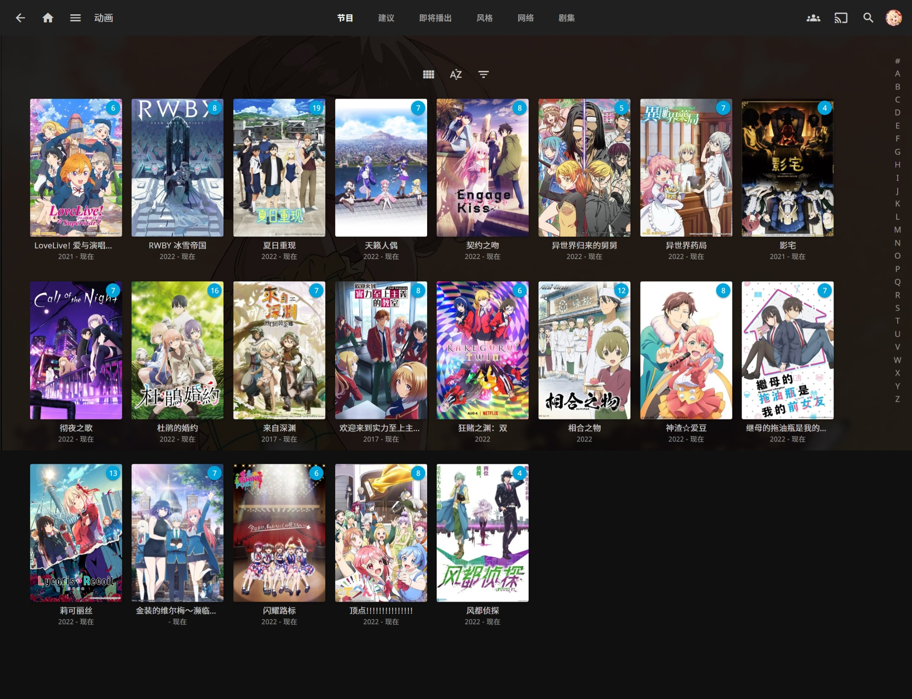

# :tv: AnimeSpace

[](https://www.npmjs.com/package/animespace)
[](https://github.com/yjl9903/AnimeSpace/actions/workflows/ci.yml)
[](https://animespace.onekuma.cn/)
[](./LICENSE)

<p align="center">「 你所热爱的就是你的动画 」</p>

Paste your favourite anime online.

AnimeSpace is yet another complete **solution** for **automatically following bangumis**.

All the bangumi resources are automatically collected and downloaded from [動漫花園](https://share.dmhy.org/). **Sincere thanks to [動漫花園](https://share.dmhy.org/) and all the fansubs.**

+ 📖 [中文文档](https://animespace.onekuma.cn/)
+ 📚 [部署博客](https://blog.onekuma.cn/alidriver-alist-rclone-animepaste)

> **Notice**:
>
> 👷‍♂️ Still work in progress towards v0.1.0.
>
> More docs and out-of-the-box usage will be available in v0.1.0.

## Features

+ :gear: **Automatically** collect, download and organize anime resources
+ :construction_worker_man: **Scrape anime metadata** from [Bangumi 番组计划](https://bangumi.tv/) and generate NFO file (WIP)
+ :film_strip: **Support any media server** including [Infuse](https://firecore.com/infuse), [Plex](https://www.plex.tv/), [Jellyfin](https://github.com/jellyfin/jellyfin), [Kodi](https://kodi.tv/) and so on...



## Installation

> **Prerequisite**
>
> Install latest [Node.js](https://nodejs.org/) and [pnpm](https://pnpm.io/) globally.

See [部署 | AnimeSpace](https://animespace.onekuma.cn/deploy/) and [安装 CLI | AnimeSpace](https://animespace.onekuma.cn/admin/).

## Usage

### Prepare anime plan

It supports to scrape the following list from [Bangumi 番组计划](https://bangumi.tv/).

First, ensure that you can config the Bangumi ID in your `anime.yaml`.

```yaml
plugins:
  # ...
  - name: bangumi
    username: '603937' # <- You Bangumi ID
```

Second, just the following simple command.

```bash
anime bangumi generate --fansub --create "<plan filename>.yaml"
```

See [放映计划 | AnimeSpace](https://animespace.onekuma.cn/admin/plan.html) to get more details.

Alternatively, if you share similiar interests in animation with me, you can just clone my [.animespace](https://github.com/yjl9903/.animespace) config space directory.

### Download anime resources

Just run the following simple command.

```bash
anime refresh
```

## Related Projects

+ [AnimeGarden](https://github.com/yjl9903/AnimeGarden): 動漫花園 3-rd party [mirror site](https://garden.onekuma.cn/) and API endpoint
+ [bgmc](https://github.com/yjl9903/bgmc): Bangumi Data / API Clients
+ [nfo.js](https://github.com/yjl9903/nfo.js): Parse and stringify nfo files
+ [naria2](https://github.com/yjl9903/naria2): Convenient BitTorrent Client based on the aria2 JSON-RPC
+ [BreadFS](https://github.com/yjl9903/BreadFS): Unified File System Abstraction
+ [Breadc](https://github.com/yjl9903/Breadc): Yet another Command Line Application Framework with fully TypeScript support
+ [memofunc](https://github.com/yjl9903/memofunc): Memorize your function call automatically

## Credits

+ **[動漫花園](https://share.dmhy.org/) and all the fansubs**
+ [Bangumi 番组计划](https://bangumi.tv/) provides a platform for sharing anything about ACG
+ [Bangumi Data](https://github.com/bangumi-data/bangumi-data) collects the infomation of animes
+ [aria2](能干猫今天也忧郁) and [WebTorrent](https://webtorrent.io/) provide the ability to download magnet links
+ [Anime Tracker List](https://github.com/DeSireFire/animeTrackerList) collects trackers for downloading bangumi resources

## License

AGPL-3.0 License © 2023 [XLor](https://github.com/yjl9903)
